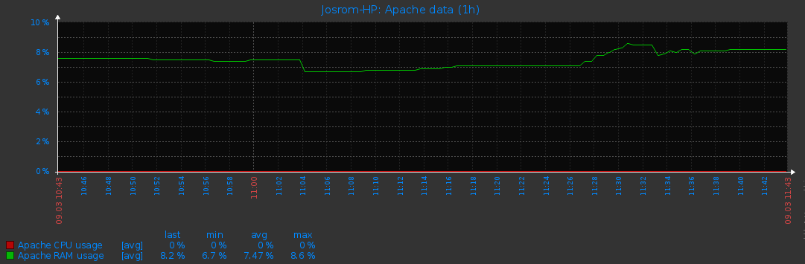
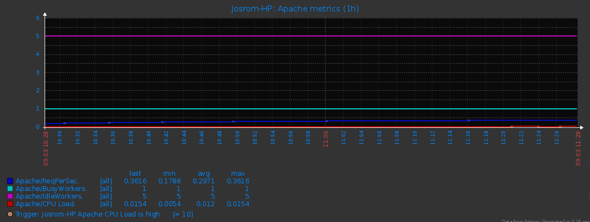
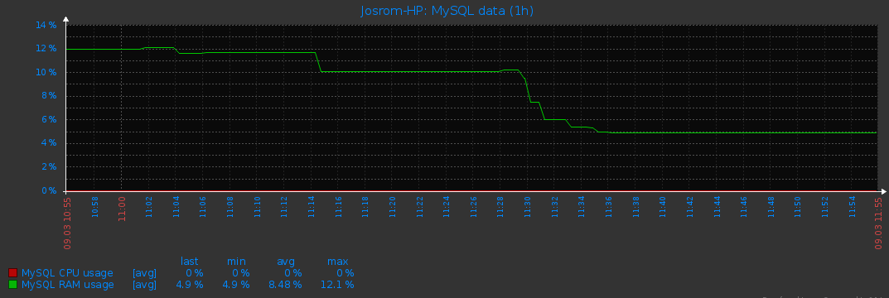

# zabbix-agent

Files needed for configuring multiple services on a server zabbix.

<!-- MarkdownTOC -->

- [Installation](#installation)
- [Basic monitoring](#basic-monitoring)
- [Services](#services)
    - [Apache2](#apache2)
        - [Items supported apache](#items-supported-apache)
        - [Graph apache](#graph-apache)
    - [MySQL](#mysql)
        - [Items supported MySQL](#items-supported-mysql)
        - [Graph MySQL](#graph-mysql)

<!-- /MarkdownTOC -->


## Installation

Copy the folder `services` in the zabbix agent path (ex: `/etc/zabbix/`).  
In the file of configuration the zabbix agent add this line if it isn't:  
```
Include=/etc/zabbix/services/
```

>Note:  
>* If you copy this folder in other path that it isn't `/etc/zabbix/` you need modify the file `services/user_services.conf`:

>>* Change the path of services:
>>* ```Include=/etc/zabbix/services/*/*.conf```

## Basic monitoring

This template provide the basic metrics for monitoring the CPU, process, memory, network...  
Only you need is import the template `basic_monitor_template.xml`

## Services

Templates services

### Apache2

Include the file of configuration(`services/apache2/user_apache2.conf`) in the zabbix agent.  
Import the template(`services/apache2/zbx_template_apache.xml`) in the zabbix server.
Ensure that the file(`services/apache2/apache.sh`) has permissions of execution.  

#### Items supported apache

* apache.cpu.usage: % load of CPU
* apache.ram.usage: % load of MEM
* apache[*]: Differents data from the apache2

>* apache[{HOST.DNS},BusyWorkers]
>* apache[{HOST.DNS},BytesPerReq]
>* apache[{HOST.DNS},BytesPerSec]
>* apache[{HOST.DNS},ClosingConnection]
>* apache[{HOST.DNS},CPULoad]
>* apache[{HOST.DNS},DNSLookup]
>* apache[{HOST.DNS},GracefullyFinishing]
>* apache[{HOST.DNS},IdleCleanupOfWorker]
>* apache[{HOST.DNS},IdleWorkers]
>* apache[{HOST.DNS},KeepAlive]
>* apache[{HOST.DNS},Logging]
>* apache[{HOST.DNS},OpenSlotWithNoCurrentProcess]
>* apache[{HOST.DNS},ReadingRequest]
>* apache[{HOST.DNS},ReqPerSec]
>* apache[{HOST.DNS},ScriptVersion]
>* apache[{HOST.DNS},SendingReply]
>* apache[{HOST.DNS},StartingUp]
>* apache[{HOST.DNS},TotalAccesses]
>* apache[{HOST.DNS},TotalKBytes]
>* apache[{HOST.DNS},Uptime]
>* apache[{HOST.DNS},Version]
>* apache[{HOST.DNS},WaitingForConnection]

#### Graph apache

This template has graphs with the load in the server:

and the metrics of apache:


### MySQL

Include the file of configuration(`services/mysql/user_mysql.conf`) in the zabbix agent.  
Import the template(`services/mysql/zbx_template_mysql.xml`) in the zabbix server.  
Ensure that the file(`services/mysql/mysql.sh`) has permissions of execution.  

>Note:  
>* Probably you need change the user and password to access the mysql server.
>* In the file `services/mysql/user_mysql.conf` you must change `-uzabbix` for your user and `-pzabbix` for your password
>* In the file `services/mysql/mysql.sh` you must change `USQL="zabbix"` for your user and `PASSWORDSQL="zabbix"` for your password

#### Items supported MySQL

* mysql.cpu.usage: % load of CPU
* mysql.ram.usage: % load of MEM
* mysql.uptime: time to service it's up
* mysql.qps: number the queries per second
* mysql.version: version of mysql is installed
* mysql.questions: number the questions realiced
* mysql.ping: check if the server is alive
* mysql.threads: number of threads
* mysql.slowqueries: number of slowqueries
* mysql_template[*]:

>* mysql_template[Uptime]
>* mysql_template[ConnectionId]
>* mysql_template[Connection]
>* mysql_template[ServerVersion]
>* mysql_template[UnixSocket]
>* mysql_template[SSL]
>* mysql_template[QtdDataBases]
>* mysql_template[DataBaseNames]

#### Graph MySQL

This template has graphs with the load in the server:
